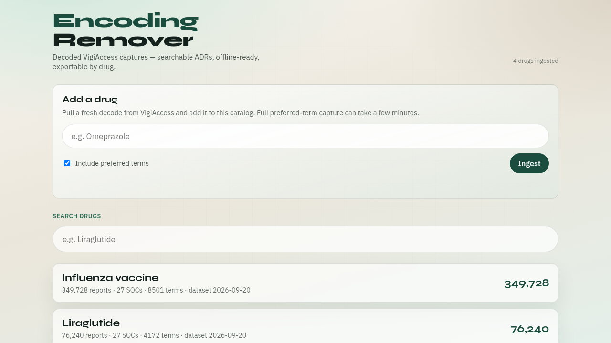
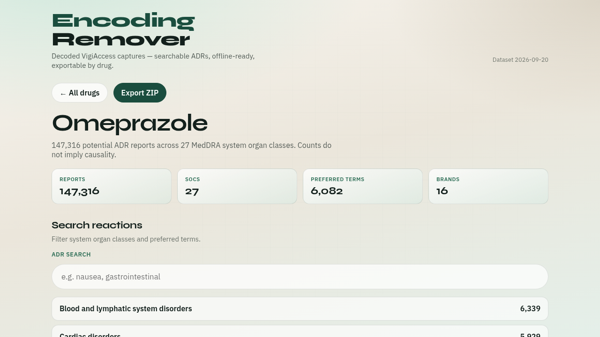
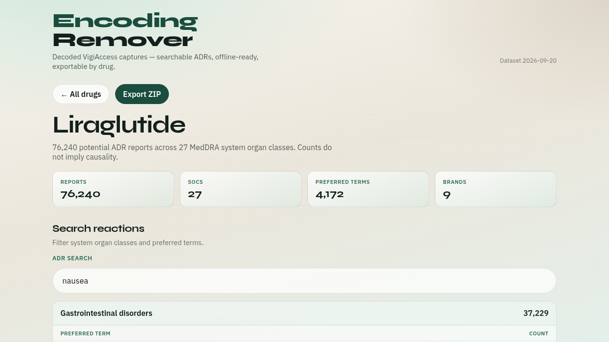

<p align="center">
  
</p>

# Encoding Remover

Decode VigiAccess’s “hidden encoding”, browse adverse-reaction captures in a searchable PWA, and export any drug as a ZIP.

**Live demo:** [https://chunder.wizwam.com/](https://chunder.wizwam.com/)

<p align="center">
  
</p>

<p align="center"><em>Ingest new drugs from the web UI, search the catalog, open any capture.</em></p>

---

## What this solves

VigiAccess responses look like gibberish in DevTools — not because they’re Base64, but because they are:

1. **MessagePack** binary (`application/vnd.msgpack`)
2. **Unicode-obfuscated** drug / ADR names (invisible Cf/Mn characters)
3. **Opaque Encrypted IDs** used only to chain follow-up API calls

This project unpacks all of that into clean JSON, serves it as an installable PWA, and lets you pull fresh drugs from the public remoting API.

---

## Screenshots

### Drug detail + ZIP export

<p align="center">
  
</p>

<p align="center"><em>Omeprazole — 147k reports, MedDRA SOCs, preferred terms, demographic charts, one-click ZIP.</em></p>

### ADR search

<p align="center">
  
</p>

<p align="center"><em>Filter system organ classes and preferred terms (example: nausea on Liraglutide).</em></p>

---

## Quick start

```bash
python3 -m venv .venv
source .venv/bin/activate
pip install -e '.[dev]'

# Capture + ingest a drug into data/
encoding-remover capture Omeprazole -o out/omeprazole.json --ingest

# Build & serve the PWA
cd web && npm install && npm run build && cd ..
encoding-remover serve --port 4173
```

Or open the live site and use **Add a drug** → **Ingest**.

---

## Features

| Area | What you get |
|------|----------------|
| **Decoder** | MessagePack unpack + Unicode deobfuscation |
| **CLI** | `capture`, `search`, `decode-file`, `ingest`, `serve` |
| **PWA** | Catalog, ADR search, charts, offline-friendly shell |
| **Ingest UI** | `POST /api/ingest` + job polling (works on chunder.wizwam.com) |
| **Export** | Per-drug ZIP with `capture.json` + CSVs |

### Architecture

```text
VigiAccess remoting          encoding-remover              PWA
─────────────────            ────────────────              ───
POST /search          →      MessagePack decode     →      data/catalog.json
POST /distribution    →      deobfuscate strings    →      data/drugs/*.json
POST /primaryTerm     →      ingest catalog         →      browse / search / ZIP
```

---

## CLI cheat sheet

```bash
# Full capture (preferred terms + ingest for the PWA)
encoding-remover capture Liraglutide -o out/liraglutide.json --ingest

# Faster summary (skip preferred-term pagination)
encoding-remover capture Liraglutide -o out/summary.json --no-preferred-terms --ingest

# Ingest an existing capture JSON
encoding-remover ingest out/liraglutide/capture.json

# Decode a raw DevTools .msgpack blob
encoding-remover decode-file tests/fixtures/search_liraglutide.msgpack -k search

# Serve built PWA + data + ingest API
encoding-remover serve --port 4173
```

### HTTP ingest API (used by the PWA)

```bash
# Start a job
curl -sS -X POST https://chunder.wizwam.com/api/ingest \
  -H 'Content-Type: application/json' \
  -d '{"query":"Omeprazole","include_preferred_terms":true}'

# Poll status
curl -sS https://chunder.wizwam.com/api/ingest/<job_id>
```

---

## Project layout

```text
encoding-remover/
├── src/encoding_remover/   # client, decode, ingest, serve, CLI
├── web/                    # Vite + TypeScript PWA
├── data/                   # catalog.json + drugs/*.json
├── docs/screenshots/       # README images
└── tests/                  # offline MessagePack fixtures
```

---

## Development

```bash
# Python tests
pytest

# PWA hot reload (proxies /data and /api to :4173 when the server is up)
cd web && npm run dev
```

Production on this host: systemd user unit `encoding-remover-pwa.service` → `127.0.0.1:4173`, published via `t1-cf-tunnel` as **chunder.wizwam.com**.

---

## Caveats (WHO / UMC)

VigiAccess shows **potential** side effects from VigiBase aggregates. Counts do **not** imply causality, incidence, or comparable safety between products. Individual case reports are not available.

Be polite to the upstream API (`--delay` between preferred-term pages). For commercial product integration, consider the official [VigiAccess API](https://who-umc.org/vigibase-data-access/vigiaccess-api/) (paid / contact UMC).

---

## License

Personal / research use. VigiAccess data remains subject to WHO / UMC terms and caveats.
